<p align="center">
  
</p>

[](https://github.com/tef-dig/webview-bridge)
[](https://github.com/tef-dig/webview-bridge/blob/master/LICENSE)


JavaScript library to access to native functionality. Requires a webview with a
postMessage bridge.

Library size ~1.2 Kb (min + gzip)

[AMD](https://github.com/amdjs/amdjs-api/wiki/AMD),
[UMD](https://github.com/umdjs/umd),
[IIFE](https://developer.mozilla.org/en-US/docs/Glossary/IIFE),
[ES Module](https://developer.mozilla.org/en-US/docs/Web/JavaScript/Reference/Statements/import)
builds available (see
[package dist folder](https://unpkg.com/@tef-novum/webview-bridge/dist/)). Open
an issue if you need a different build.

## Usage

### NPM

We recommend to manage your dependencies using `npm` or `yarn` and use a bundler
like [webpack](https://webpack.js.org/) or [parcel](https://parceljs.org/). Once
configured, you can use
[ES imports](https://developer.mozilla.org/en-US/docs/Web/JavaScript/Reference/Statements/import).

Install using `npm`:

```bash
npm i @tef-novum/webview-bridge
```

Install using `yarn`:

```bash
yarn add @tef-novum/webview-bridge
```

Import required function and use it:

```javascript
import {setWebViewTitle} from '@tef-novum/webview-bridge';

setWebViewTitle('Hello, world');
```

### CDN

Alternatively, you can import the library directly from a CDN:

```html
<script src="https://unpkg.com/@tef-novum/webview-bridge/dist/webview-bridge-iife.min.js"></script>

<script>
    webviewBridge.setWebViewTitle('Hello, world');
</script>
```

## API

### isWebViewBridgeAvailable

Returns true if WebView Bridge is available. Use this function to implement
fallbacks in case the bridge is not available.

```ts
isWebViewBridgeAvailable: () => boolean;
```

#### Inside an `iframe`

By default, the bridge will be disabled inside an iframe. If you want to enable
it, add a `data-enable-webview-bridge` attribute to the host `iframe` element.

#### Example

```javascript
if (isWebViewBridgeAvailable()) {
    nativeAlert('Hello'); // use bridge
} else {
    myCustomAlert('Hello'); // use alternative implementation
}
```

You may want to detect if the page is displayed inside a regular browser or an
Android or iOS WebView.

```javascript
/** Returns true if application is running inside a Novum App WebView */
const isWebView = () => isWebViewBridgeAvailable();

/** Returns true if application is running inside a Novum App WebView running on Android */
const isAndroidWebView = () =>
    isWebViewBridgeAvailable() && navigator.userAgent.includes('Android');

/** Returns true if application is running inside a Novum App WebView running on iOS */
const isIOSWebView = () =>
    isWebViewBridgeAvailable() && !navigator.userAgent.includes('Android');
```

### requestContact

Show native picker UI in order to let the user select a contact.

-   Android only: picker UI elements can be filtered by available phones
    (default) or emails. `filter` property is ignored by iOS devices

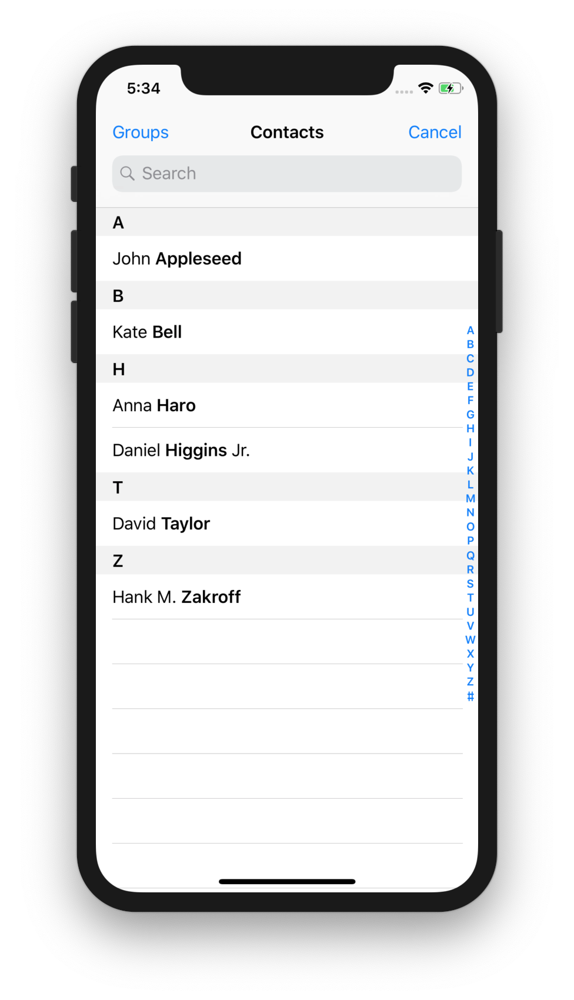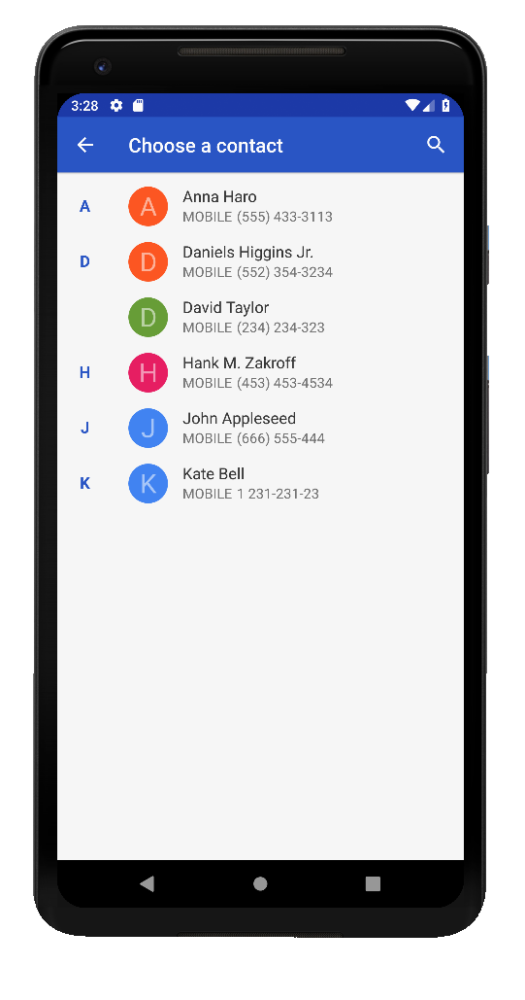

```ts
requestContact: ({filter?: 'phone' | 'email'}) => Promise<{
    name?: string;
    email?: string;
    phoneNumber?: string;
    address?: {
        street?: string;
        city?: string;
        country?: string;
        postalCode?: string;
    };
}>;
```

All fields in response object are optional

#### Example

```javascript
requestContact({filter: 'phone'}).then((contact) => {
    console.log(contact);
}).catch(err => {
    console.error(err);
};
```

### createCalendarEvent

Inserts an event in calendar

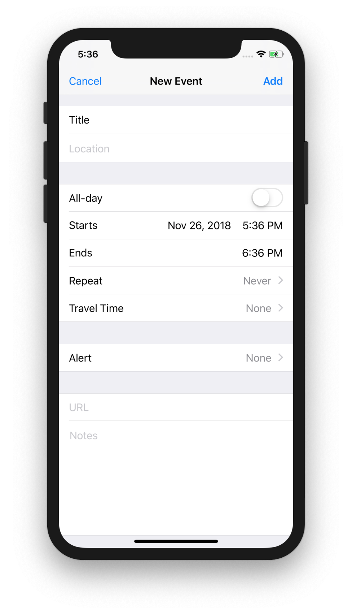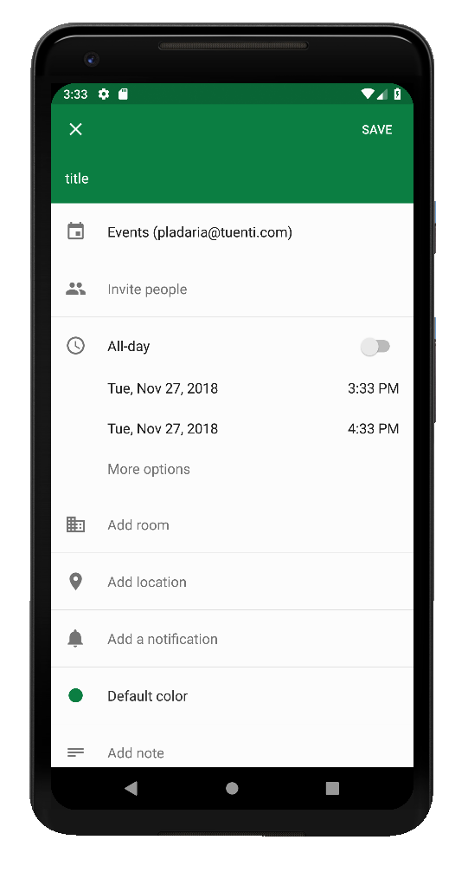

```ts
createCalendarEvent: ({
    beginTime: number,
    endTime: number,
    title: string
}) => Promise<void>;
```

`beginTime` and `endTime` are timestamps with millisecond precision

#### Example

```javascript
createCalendarEvent({
    beginTime: new Date(2019, 10, 06).getTime(),
    endTime: new Date(2019, 10, 07).getTime(),
    title: "Peter's birthday",
}).then(() => {
    console.log('event created');
}).catch(err => {
    console.error(err);
};
```

### share

<kbd>App version >=10.7</kbd>

Invokes the native sharing mechanism of the device.

```ts
type ShareOptions =
    | {
          text: string;
      }
    | {
          url: string;
          fileName: string;
          text?: string;
      };

share: (options: ShareOptions) => Promise<void>;
```

-   If no `url` is present, `text` is used as item to share
-   If `url` param is present, it contains the URL to the shared file
-   `fileName` param is mandatory if `url` is set
-   If `url` and `text` are set, `text` is used as `Intent BODY` (if platform
    allows it)

#### Example

```javascript
// sharing a text string
share({text: 'Hello, world!'});

// sharing a file
share({url: 'https://path/to/file', fileName: 'lolcats.png'});
```

### shareBase64

<kbd>App version >=24.6</kbd>

Invokes the native sharing mechanism of the device to share a file. The file is
provided as a base64 encoded string.

```ts
shareBase64: ({contentInBase64: string; fileName: string}) => Promise<void>;
```

-   The file type will be inferred from the `fileName` extension.

#### Example

```ts
shareBase64({
    contentInBase64: 'SGVsbG8sIHd(...)vcmxkCg==',
    fileName: 'hello.pdf',
});
```

### updateNavigationBar

<kbd>App version >= 10.7: Partial support</kbd><br/> <kbd>App version >= 11.8:
expandedTitle</kbd><br/> <kbd>App version >= 14.8: Additional properties and
deprecations</kbd>

Customize WebView NavigationBar properties. You can set one or more properties
in a single call

```ts
type NavigationBarIcon = {
    /** Content description of the image used for accessibility */
    name: string;
    /**
     * This is a string whose value will be mapped to a local resource that the app already knows.
     * See https://void.tuenti.io/idl-server/files/TopNavbarIcon/1.1 for available values.
     * A fallback icon will be used if the app doesn't recognize the value.
     */
    iconEnum?: string;
    /**
     * Set of urls that the app will use to render the icon.
     * If both iconEnum and icon are received, the iconEnum should be used as a fallback in case there's some issue with the urls.
     */
    icon?: {
        /**
         * Those urls should be icons in PNG format.
         * The icons will not be rendered until the image has been downloaded by the app.
         * The URLs should be inmutable to allow the app to cache those icons for an arbitrary amount of time.
         */
        url: string;
        /** To be used if present when dark mode is activated. */
        urlDark?: string;
    };
    badge?: {
        /**
         * Boolean to determine if the badge should be shown
         * If `show` is `true` and number and nativeLogic are not present, the badge will be shown as a dot
         */
        show: boolean;
        /** Same logic and current same supported values as in nativeLogic field from API */
        nativeLogic?: 'INBOX' | 'PROFILE';
        /** Hardcoded value to set as the badge count. It will have more priority than nativeLogic. */
        number?: number;
    };
    /**
     * Tracking properties to be sent to analytics when the icon is clicked.
     * These properties will be merged to the tracking event produced by the native side
     */
    trackingProperties?: Record<string, string>;
}

updateNavigationBar = ({
    title?: string;
    expandedTitle?: string;
    showBackButton?: boolean;
    showReloadButton?: boolean;
    showProfileButton?: boolean; // deprecated in app version >= 14.8
    backgroundColor?: string;
    leftActions?: ReadonlyArray<NavigationBarIcon>; // requires app version >= 14.8
    rightActions?: ReadonlyArray<NavigationBarIcon>; // requires app version >= 14.8
    colorVariant?: 'INVERSE' | 'REGULAR' | null; // requires app version >= 14.8
    resetToDefaultState?: boolean; // requires app version >= 14.8
}) => Promise<void>
```

-   `title`: updates NavigationBar title
-   `expandedTitle`: updates NavigationBar expandedTitle. If the value is an
    empty string, the expanded navigation bar will not be shown. Only available
    in native app versions >= 11.8
-   `showBackButton`: shows or hides back icon in NavigationBar
-   `showReloadButton`: shows or hides NavigationBar Reload button
-   `showProfileButton`: **DEPRECATED**. New apps will ignore this field
-   `backgroundColor`: change NavigationBar background color, use a hex color
    string (for example: `'#FF128A'`)
-   `leftActions`: array of icons to show in the left side
-   `rightActions`: array of icons to show in the right side
-   `colorVariant`: defines how the icons and the text of the top bar should be
    tinted. If null or unknown value is received, the initial colors set by the
    app or the last colorVariant set will be used
-   `resetToDefaultState`: This is a flag used to indicate that the appearance
    of the top bar should be restored to its original state. The other fields
    that may come in the same bridge call will be applied after the reset

#### Examples

```javascript
// updates WebView NavigationBar title
updateNavigationBar({title: 'Hello, World!'});

// full featured example
updateNavigationBar({
    title: 'Hello',
    expandedTitle: 'Hello, World!',
    showBackButton: true,
    showReloadButton: false,
    backgroundColor: '#FF0000',
    leftNavigationIcons: [
        {
            name: 'icon name',
            iconEnum: 'SOME_ICON',
            badge: {
                show: true,
                nativeLogic: 'INBOX',
            },
        },
    ],
    rightNavigationIcons: [
        {
            name: 'icon name',
            iconEnum: 'icon enum value',
            icon: {
                url: 'https://path/to/icon',
                urlDark: 'https://path/to/icon/dark',
            },
            badge: {
                show: true,
                number: 1,
            },
        },
    ],
    resetToDefaultState: true,
    trackingProperties?: {'name': 'some icon clicked'},
});
```

### onNavigationBarIconClicked

<kbd>App version >=14.8</kbd>

Listen to navigation bar icon clicks and execute a callback function

#### React example

```tsx
React.useEffect(() => {
    const unsubscribe = onNavigationBarIconClicked(({id}) => {
        console.log(`Icon with id ${id} clicked`);
    });

    // Unsubscribe when the component is unmounted
    return () => {
        unsubscribe();
    };
}, []);
```

### isABTestingAvailable

<kbd>App version >=10.8</kbd>

Returns true if A/B testing named with the key is available.

```ts
isABTestingAvailable: (key: string) => Promise<boolean>;
```

### nativeConfirm

<kbd>App version >=24.6 `destructive` support.</kbd>

Show a native confirm dialog.

If the bridge is not present (eg. showing the page in browser), fallbacks to a
browser confirm.

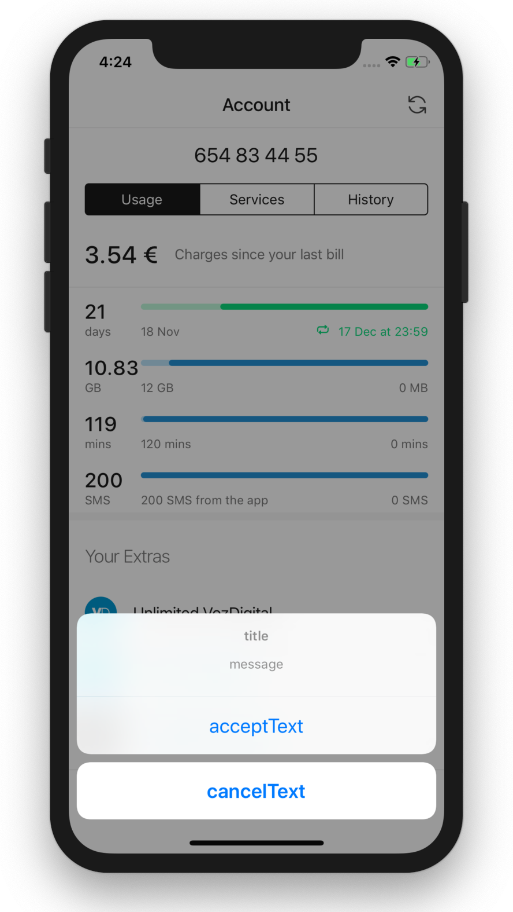

```ts
nativeConfirm: ({
    message: string;
    title?: string;
    acceptText: string;
    cancelText: string;
    destructive?: boolean;
}) => Promise<boolean>;
```

#### Example

```javascript
nativeConfirm({
    title: 'Confirm',
    message: 'Send message?',
    acceptText: 'Yes',
    cancelText: 'No',
}).then((res) => {
    if (res) {
        console.log('message sent');
    }
});
```

### nativeAlert

Show a native alert dialog.

If the bridge is not present (eg. showing the page in browser), fallbacks to a
browser alert.

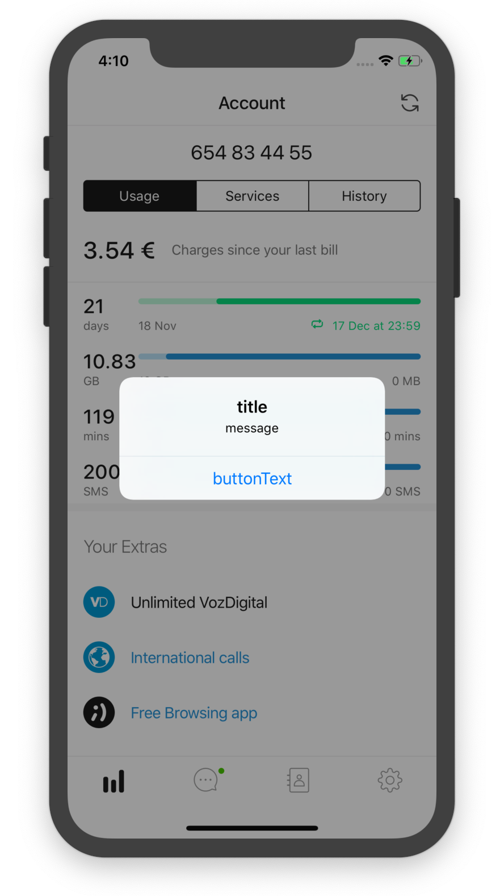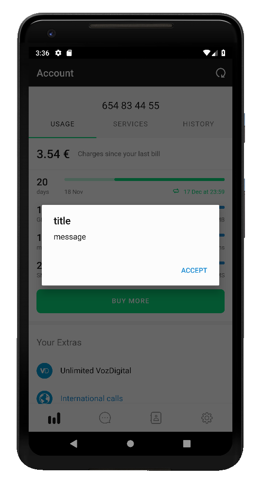

```ts
nativeAlert: ({
    message: string;
    title?: string;
    buttonText: string;
}) => Promise<void>;
```

### nativeMessage

<kbd>App version >=14.10 `withDismiss`, `duration` and `action` in
response</kbd>.

<kbd>App version >=24.6 `buttonAccessibilityLabel` support</kbd>.

Show a native snackbar message. Use it to display feedback messages.

If the bridge is not present (eg. showing the page in browser), fallbacks to a
browser alert.

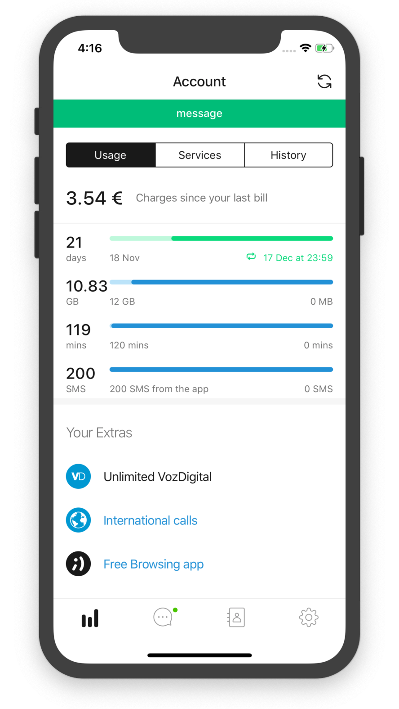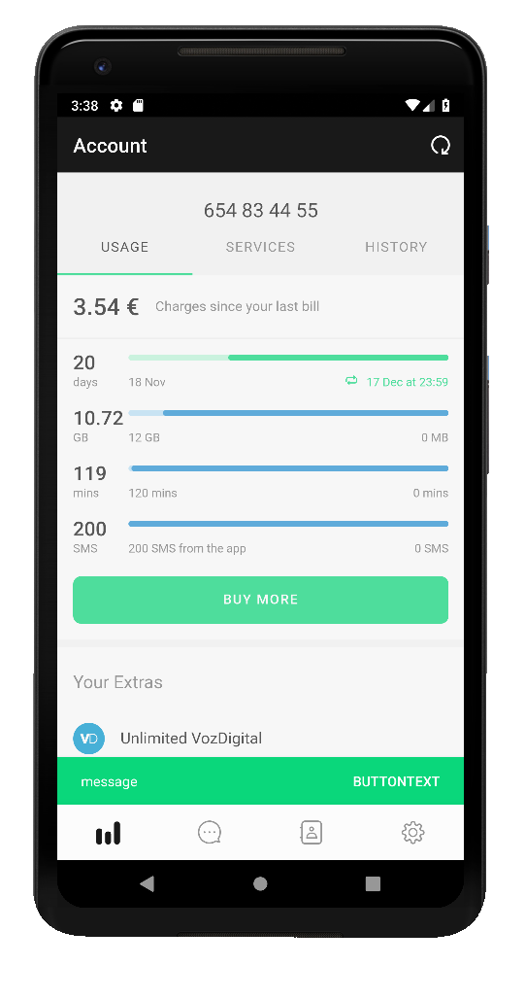

```ts
nativeMessage: ({
        message: string;
        duration?: 'PERSISTENT';
        buttonText?: string;
        buttonAccessibilityLabel?: string;
        type?: 'INFORMATIVE' | 'CRITICAL' | 'SUCCESS';
        withDismiss?: boolean;
}) => Promise<{
    action: 'DISMISS' | 'BUTTON' | 'TIMEOUT' | 'CONSECUTIVE';
}>;
```

#### Example

Show a native Snackbar with button

```javascript
nativeMessage({
    message: 'Operation finished!',
    buttonText: 'Ok',
}).then((res) => {
    if (res.action === 'BUTTON') {
        console.log('Button clicked');
    }
    console.log('Snackbar closed');
});
```

### logEvent

Log an event to firebase

```ts
logEvent: ({
    category: string; // Typically the object that was interacted with (e.g. 'Video')
    action: string; // The type of interaction (e.g. 'play')
    label?: string; // Useful for categorizing events (e.g. 'Fall Campaign')
    value?: number; // A numeric value associated with the event (e.g. 43)
}) => Promise<void>;
```

If you want to use new Google Analytics 4 event format you can use this method
too:

```ts
logEvent: ({
    name: string; // The event name is mandatory
    [key: string]: any; // You can set any other event parameters
}, {
    sanitize?: boolean; // Whether to sanitize the event params, this only affects to FirebaseEvents. true by default.
}) => Promise<void>;
```

#### Example

```javascript
logEvent({
    category: 'topup-flow',
    action: 'topup',
}).then(() => {
    console.log('event logged');
});

// Or with GA4 format
logEvent({
    name: 'user_interaction',
    component_type: 'primary_button',
    component_copy: 'topup',
}).then(() => {
    console.log('event logged');
});
```

#### About event params sanitization

By default, GA4 event params are sanitized. The sanitization consists of
removing whitespaces and some special characters, lowercasing and trimming. This
allows us having a consistent event format accross events.

In some cases you may want to disable this behavior. To do so, you can set the
`sanitize` option to `false`:

```javascript
logEvent(yourEvent, {sanitize: false});
```

### setScreenName

Log the current screen name (or page name) to firebase

```ts
setScreenName: (screenName: string, params?: {[key: string]: any}) => Promise<void>;
```

### setUserProperty

Set a user property to firebase

```ts
setUserProperty: (name: string, value: string) => Promise<void>;
```

### reportStatus

<kbd>App version >=11.2</kbd>

Report a given feature status

```ts
reportStatus: ({feature: 'ACCOUNT', status: 'CRITICAL' | 'GOOD' | 'BAD', reason: string}) => Promise<void>;
```

### onNativeEvent

<kbd>App version >=11.3</kbd>

Listens to native app events

```ts
type NativeEventHandler = ({ event }: {event: string}) => {action: 'default'};

onNativeEvent: (handler: NativeEventHandler) => () => void;
```

#### Example

```ts
onNativeEvent(({event}) => {
    if (event === 'tappedNavigationBarBackButton') {
        // do something
    }
    return {action: 'default'};
});
```

#### Available events

-   `tappedNavigationBarBackButton`: fired when the user taps on the back button
    of the native Navigation Bar. Allowed response actions: `default`

### checkPermissionStatus

<kbd>App version >=11.4</kbd>

Returns true if the app has the specific notifications permissions. You have to
pass feature and required params for this request.

Avalaible features:

-   `notifications`
-   `read-contacts` (Available for app versions 13.10 and higher)
-   `write-contacts` (Available for app versions 13.10 and higher)

```ts
checkPermissionStatus: (feature: string, params?: {[key: string]: string}) => Promise<boolean>;
```

#### Example

```javascript
checkPermissionStatus('notifications', {channelId: 'default'}).then(
    (hasPermissions) => {
        console.log(hasPermissions);
    },
);
```

### internalNavigation

<kbd>App version >=11.4</kbd><br/>

Init an internal and native navigation to a device specific feature

Avalaible features:

-   `notification-settings`
-   `contact-settings` <kbd>App version >=13.10 </kbd>

```ts
internalNavigation: (feature: string) => Promise<void>;
```

### dismiss

<kbd>App version >=11.5</kbd>

Dismiss the current webview and optionally navigate to another url

```ts
dismiss: (onCompletionUrl?: string) => Promise<void>;
```

### requestVibration

Requests the phone to vibrate. Options are 'error' or 'success'.

```javascript
requestVibration('error');
```

### fetchContactsByPhone

Returns contacts info given an array of phone numbers.

```javascript
fetchContactsByPhone: (phoneNumbers: Array<string>) => Promise<Array<{
    phoneNumber: string;
    firstName?: string;
    middleName?: string;
    lastName?: string;
    encodedAvatar?: string;
}>>;
```

### getAppMetadata

<kbd>App version >=11.8</kbd>

Check if an app is installed in the phone

```ts
getAppMetadata: (appToken: string) => Promise<{
    isInstalled: boolean;
    marketUrl: string;
    appUrl: string
}>;
```

-   `appToken`: token that refers to a "friend" application
-   `isInstalled`: boolean to see if the app is installed
-   `appUrl`: string url to launch an app installed on the phone
-   `marketUrl`: string url to launch the store in a specific application

### getDiskSpaceInfo

<kbd>App version >=11.10</kbd>

Return info about how much free disk space the device has

```ts
getDiskSpaceInfo: () => Promise<{availableBytes: number, totalBytes: number}>;
```

-   `availableBytes`: number to see available bytes in the device
-   `totalBytes`: number to see the total bytes in the device

### getEsimInfo

<kbd>App version >=12.3 `supportsEsim`</kbd><br/> <kbd>App version >=14.8
`eid`</kbd>

Return info about the esim capabilities of the device

```ts
getEsimInfo: () => Promise<{supportsEsim: boolean, eid?: string | null}>;
```

-   `supportsEsim`: tells if the device supports esim
-   `eid`: "Embedded Identity Document". The serial number corresponding to the
    eSIM installed in a device.

### getDeviceModel

<kbd>App version >=14.8</kbd>

Returns the device model, like `"SAMSUNG-SM-G930A"`, `"iPhone9"`, ...

```ts
getDeviceModel: () => Promise<{model: string} | null>;
```

### setTrackingProperty

<kbd>App version >=12.4</kbd>

Sets a property related to some specific tracking system

```ts
setTrackingProperty: (system: 'palitagem' | 'medallia', name: string, value?: string) => Promise<void>;
```

-   `system`: Tracking system that will handle the property
-   `name`: name of the property
-   `value`: value of the property (nullable)

### setActionBehavior

<kbd>App version >=12.7</kbd>

Method that allows defining an specific behavior (such as showing a
confirmation) before the specific native actions are executed. This method also
allows disabling any previous behaviors set.

```ts
type ActionBehavior =
    | {
        behavior: 'confirm';
        title: string;
        message: string;
        acceptText: string;
        cancelText: string;
    }
    | {
        behavior: 'default';
    }
    | {
        behavior: 'cancel';
    };

setActionBehavior: (actions: {webviewClose?: ActionBehavior, navigationBack?: ActionBehavior}) => Promise<void>;
```

`navigationBack` and `webviewClose` actions are currently available:

-   `navigationBack`: Action bar back button pressed (also for physical back
    button in android but not swipe back gesture in iOS, which will be
    disabled).
-   `webviewClose`: Action bar close button pressed. Includes both "X" and
    "Close" buttons (but not swipe down gesture in iOS, which will be disabled).

Both have same allowed json parameters, and 3 allowed behaviors:

-   `confirm` Show a confirmation dialog with the required title, message and
    buttons.
-   `cancel` Prevent action from being performed, just ignoring it.
-   `default` Set default behavior for the action. (Usually to reset any
    previously specified behavior).

Actions can be optionally included in the payload. Any not included action won’t
change its current behavior set.

All actions behaviors will be automatically set to default on full page loads.

### renewSession

Tell the app to renew the session.

```ts
renewSession = (
    oldAccessToken: string | null,
    options: {timeout?: number} = {},
) => Promise<string>
```

### onSessionRenewed

Defines a callback that will be executed when the native app renews the session.
Returns the unsubscribe function.

```ts
onSessionRenewed = (
    handler: (newAccessToken: string) => void,
) => (() => void)
```

### logout

A method that requests a user logout.

```ts
logout = () => Promise<{success: boolean}>
```

### getTopazToken

Returns the [Topaz](https://www.topaz.com.br/ofd/index.php) token.

```ts
getTopazToken = (options: {timeout?: number} = {}) => Promise<{token: string}>
```

### showAppRating

Show native app rating dialog

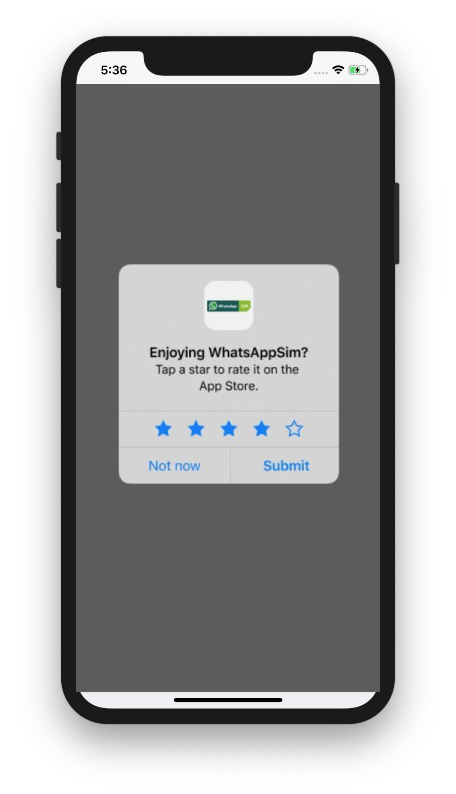

```ts
showAppRating = () => Promise<void>
```

### bottomSheet

<kbd>App version >=13.8</kbd>

Show native bottom sheet UI

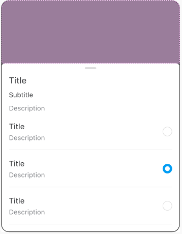

```ts
bottomSheet = (payload: SheetUI) => Promise<SheetResponse>
// see SheetUI and SheetResponse types
```

:warning: If you try to call this method repeatedly while a sheet is already
being opened (for example, user accidental double tap), it will throw an Error
with code `423` (Locked)

There are some specific cases of bottom sheet, and we have some utility methods
to make them simpler to use:

For single selection use `bottomSheetSingleSelector`:

```ts
bottomSheetSingleSelector = ({
    title?: string;
    subtitle?: string;
    description?: string;
    selectedId?: string;
    items: Array<SheetRowItem>;
}) => Promise<{action: 'SUBMIT' | 'DISMISS'; selectedId: string}>
```

For a bottom sheet with a list of actions use `bottomSheetActionSelector`:

```ts
bottomSheetActionSelector = ({
    title?: string;
    subtitle?: string;
    description?: string;
    items: Array<SheetActionItem>;
}) => Promise<{action: 'SUBMIT' | 'DISMISS'; selectedId: string}>
```

For an informative bottom sheet use `bottomSheetInfo`:

```ts
bottomSheetInfo = ({
    title?: string;
    subtitle?: string;
    description?: string;
    items: Array<SheetInfoItem>;
}) => Promise<void>
```

For a bottom sheet with ButtonPrimary/ButtonSecondary/ButtonLink use
`bottomSheetActions` <kbd>App version >=14.8</kbd>:

```ts
bottomSheetActions = ({
    title?: string;
    subtitle?: string;
    description?: string;
    button: {
        text: string;
    };
    secondaryButton?: {
        text: string;
    };
    link?: {
        text: string;
        withChevron?: boolean;
    };
}) => Promise<{action: 'PRIMARY' | 'SECONDARY' | 'LINK' | 'DISMISS'}>
```

#### Example:

```ts
const {action, selected} = await bottomSheetSingleSelector({
    title: 'Some title',
    subtitle: 'Some subtitle',
    description: 'Some description',
    selectedId: 'item-1',
    items: [
        {
            id: 'item-0',
            title: 'item 0 title',
            description: 'item 0 description',
        },
        {
            id: 'item-1',
            title: 'item 1 title',
            description: 'item 1 description',
        },
        {
            id: 'item-2',
            title: 'item 2 title',
            description: 'item 2 description',
        },
    ],
});
```

### fetchPhoneNumbers

<kbd>App version >=13.10</kbd>

Fetch all the phone numbers of the native phonebook

```ts
fetchPhoneNumbers:() => Promise<Array<{
    id: string;
    value: string;
}>>;
```

### updatePhoneNumbers

<kbd>App version >=13.10</kbd>

Updates the given phone numbers in the native phonebook

```ts
updatePhoneNumbers:(Array<{
    id: string;
    value: string;
}>) => Promise<Void>;
```

### highlightNavigationTab

Method that allows WebView to highlight a home tab bar setting a badge (numeric
or not)

```ts
highlightNavigationTab: ({
    tab: string,
    highlight: boolean,
    count?: number
}) => Promise<void>;
```

-   If `highlight` is `false`: no badge is shown
-   If `highlight` is `true`:
    -   If `count` is not `null`, it will show a numeric badge with `count`value
    -   If `count` is `null`, it will show a non-numeric badge

### getAttStatus

<kbd>App version >=14.7 (iOS)</kbd>

Method that allows a WebView to ask an iOS app user about the authorization
status of his ATT
([App Tracking Transparency](https://developer.apple.com/documentation/apptrackingtransparency))
permission.

Resolves to `null` if the app is not running on iOS or if the method is not
available

```ts
getAttStatus: () => Promise<{status:'granted' | 'denied' | 'unknown'} | null>;
```

### getNetworkConnectionInfo

<kbd>App version >=14.11</kbd>

Obtain metainformation about the current device data network connectivity

```ts
getNetworkConnectionInfo: () => Promise<{
    connectionType: 'MOBILE' | 'WIFI ' | 'OTHER' | 'NONE';
    mobileConnectionType?:
        | '2G'
        | '3G'
        | '4G'
        | '5G'
        | 'OTHER'
        | 'PERMISSION_REQUIRED'
        | null;
    mobileCarrier?: string | null;
    mobileSignalStrength?:
        | 'NONE'
        | 'POOR'
        | 'MODERATE'
        | 'GOOD'
        | 'GREAT'
        | null;
}>;
```

-   `connectionType`: describes the network technology used currently for data
-   `mobileConnectionType`: in case connectionType is 'MOBILE' gives further
    details about the network technology used. PERMISSION_REQUIRED value will be
    returned only in Android when READ_PHONE_STATE permission has not been
    granted by the user. The permission request is already managed by the
    Android implementation itself.
-   `mobileCarrier`: identifies the carrier used for 'MOBILE' connectionType
-   `mobileSignalStrength`: gives a measure of the current signal strength for
    'MOBILE' connectionType.

### getPincodeInfo

<kbd>App version >=24.2</kbd>

Check if the pincode is enabled or not

```ts
getPincodeInfo: () => Promise<{
    status: 'enabled' | 'disabled'
}>;
```

### getProfileImage

<kbd>App version >=14.9</kbd>

Read current profile picture

```ts
getProfileImage: () => Promise<{
    image: string | null
}>;
```

-   `image`: base64 encoded image or null if there is no image

### startProfileImageFlow

<kbd>App version >=14.9</kbd>

Starts the native flow to change the profile picture

```ts
startProfileImageFlow: () => Promise<{
    image: string | null;
    isCancelled: boolean;
}>;
```

-   `image`: base64 encoded image or null if the image was removed or the flow
    cancelled
-   `isCancelled`: true if the user cancelled the flow

### getDeviceTac

<kbd>App version >=24.3</kbd>

Get device [TAC identifier](https://en.wikipedia.org/wiki/Type_Allocation_Code).

```ts
getDeviceTac: () => Promise<{
    tac: string | null
}>;
```

-   `tac`: The TAC identifier is the first 8 digits of the IMEI. We already have
    a method to get the IMEI but to obtain this value, we need carrier
    privileges permission which in many cases we don't have. To get the TAC we
    don't need any special permission because it only identifies the device
    model, not the device itself. Will be `null` if it's not available (iOS
    devices or Android < 10).

### triggerPinOrBiometricAuthentication

<kbd>App version >=24.4</kbd>

Triggers pin/biometric authentication if necessary, taking into account 3
possible scenarios:

-   If user has pin/biometric already configured in the app:
    -   If last previous authentication (or last pin/biometric setup) is still
        valid, nothing will be presented to user and bridge method will succeed.
    -   Otherwise, authentication will be required, blocking the user until it
        is performed.
-   In any other case, user will be taken directly to the screen where user can
    introduce a new PIN and enable any other authentication methods. In case
    user leaves the screen without providing an authentication method, bridge
    method will fail with 401 code.

```ts
triggerPinOrBiometricAuthentication: ({
    maxSecondsSinceLastValidation: number
}) => Promise<{
    result: 'USER_AUTHENTICATED' | 'USER_ENABLED_AUTHENTICATION' | 'LAST_AUTHENTICATION_STILL_VALID',
}>;
```

-   `maxSecondsSinceLastValidation`: if time elapsed since last authentication
    is less than the number of seconds specified here authentication will
    succeed without requesting it again.

### focusNavbar

<kbd>App version >= 24.9</kbd>

Sets the screen reader focus on the native navigation bar. If the webview
doesn't have a native navbar, the native app will respond with
`{focused: false}`.

This is useful for accessibility purposes. We need the focus to be set in the
navbar when we navigate to a new screen using client side navigation (React
Router).

```ts
focusNavbar: () => Promise<{
    focused: boolean,
}>;
```

## Error handling

If an uncontrolled error occurs, promise will be rejected with an error object:

```ts
{code: number, description: string}
```

## Debugging

To inspect the bridge traffic, you can use the `setLogger` method:

```ts
setLogger((...args) => console.log(...args));
```

### openOnboarding

Opens the app Onboarding (as if it where the first time the user logs in)

```ts
openOnboarding = () => Promise<void>
```

## License

This project is licensed under the terms of the MIT license. See the
[LICENSE](LICENSE) file.
