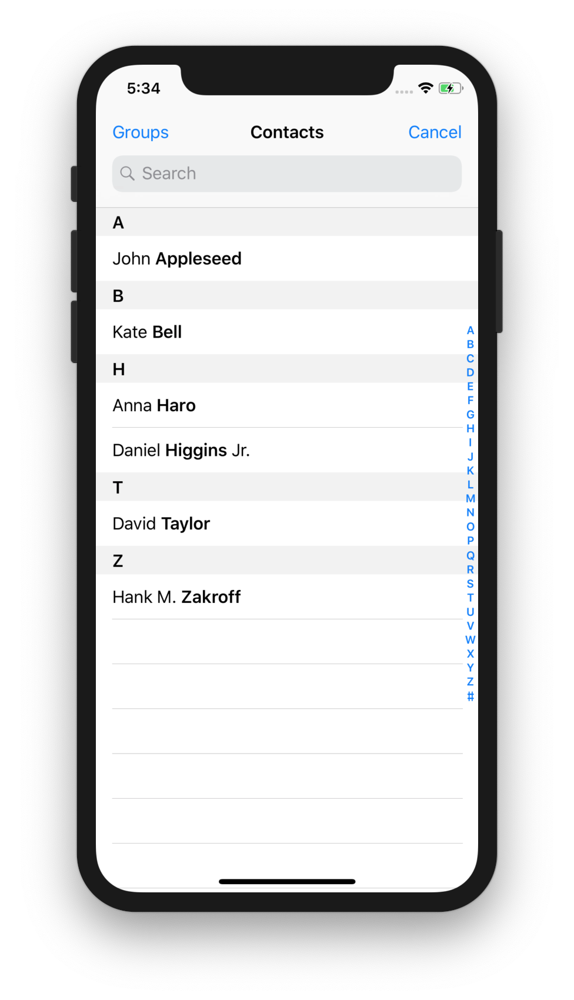
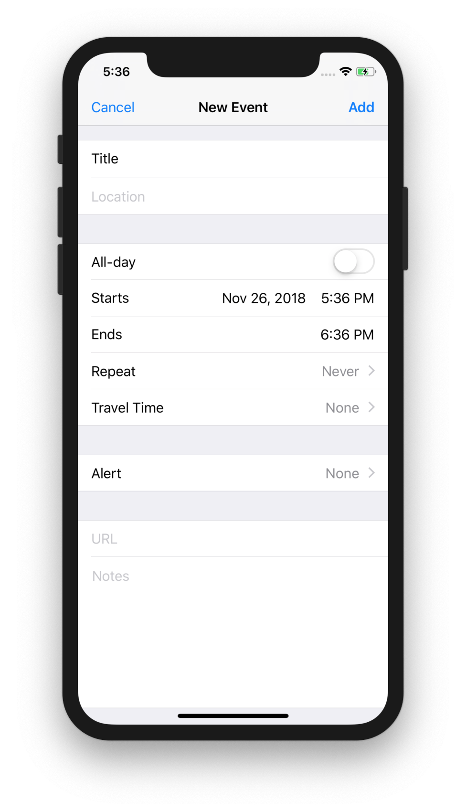
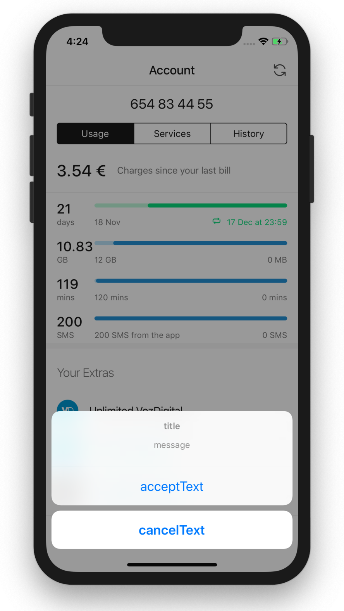
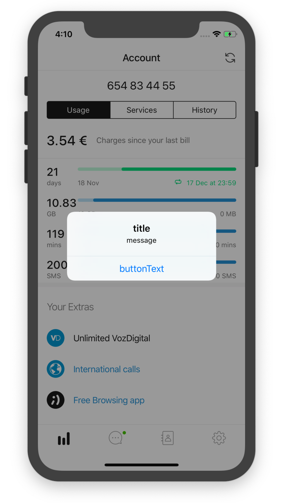
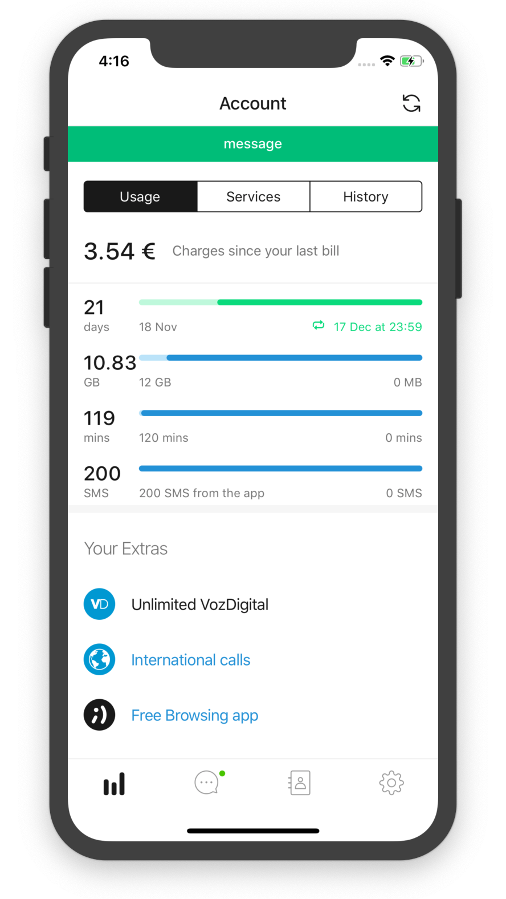

# webview-bridge

JavaScript library to access to native functionality. Requires a webview with a
postMessage bridge.

Library size ~1.2 Kb (min + gzip)

[AMD](https://github.com/amdjs/amdjs-api/wiki/AMD),
[UMD](https://github.com/umdjs/umd), ES builds available (see
[package dist folder](https://unpkg.com/@tef-novum/webview-bridge/dist/)). Open
an issue if you need a different build.

## Usage

### NPM

We recommend to manage your dependencies using `npm` or `yarn` and use a bundler
like [webpack](https://webpack.js.org/) or [parcel](https://parceljs.org/). Once
configured, you can use
[ES imports](https://developer.mozilla.org/en-US/docs/Web/JavaScript/Reference/Statements/import).

Install using `npm`:

```bash
npm i @tef-novum/webview-bridge
```

Install using `yarn`:

```bash
yarn add @tef-novum/webview-bridge
```

Import required function and use it:

```javascript
import {setWebviewTitle} from '@tef-novum/webview-bridge';

setWebviewTitle('Hello, world');
```

### CDN

Alternatively, you can import the library directly from a CDN:

```html
<script src="https://unpkg.com/@tef-novum/webview-bridge/dist/webview-bridge-umd.min.js"></script>

<script>
    webviewBridge.setWebViewTitle('Hello, world');
</script>
```

## API

-   [isWebViewBridgeAvailable](#isWebViewBridgeAvailable)
-   [requestContact](#requestcontact)
-   [createCalendarEvent](#createcalendarevent)
-   [setWebViewTitle](#setwebviewtitle)
-   [nativeConfirm](#nativeconfirm)
-   [nativeAlert](#nativealert)
-   [nativeMessage](#nativemessage)
-   [logEvent](#logevent)
-   [setScreenName](#setscreenname)
-   [Error handling](#error-handling)

### isWebViewBridgeAvailable

Returns true if WebView Bridge is available. Use this function to implement
fallbacks in case the bridge is not available.

```typescript
isWebViewBridgeAvailable: () => boolean;
```

#### Example

```javascript
import {isWebViewBridgeAvailable, nativeAlert} from '@tef-novum/webview-bridge';

if (isWebViewBridgeAvailable()) {
    nativeAlert('Hello'); // use bridge
} else {
    myCustomAlert('Hello'); // use alternative implementation
}
```

### requestContact

Show native picker UI in order to let the user select a contact.

Picker UI elements can be filtered by available phones (default) or emails



```typescript
requestContact: ({filter}?: {filter?: 'phone' | 'email'}) => Promise<{
    name?: string;
    email?: string;
    phoneNumber?: string;
    address?: {
        street?: string;
        city?: string;
        country?: string;
        postalCode?: string;
    };
}>;
```

All fields in response object are optional

#### Example

```javascript
import {requestContact} from '@tef-novum/webview-bridge';

requestContact({filter: 'phone'}).then((contact) => {
    console.log(contact);
}).catch(err => {
    console.error(err);
};
```

### createCalendarEvent

Inserts an event in calendar



```typescript
createCalendarEvent: ({
    beginTime: number,
    endTime: number,
    title: string
}) => Promise<void>;
```

`beginTime` and `endTime` are timestamps with millisecond precision

#### Example

```javascript
import {createCalendarEvent} from '@tef-novum/webview-bridge';

createCalendarEvent({
    beginTime: new Date(2019, 10, 06).getTime(),
    endTime: new Date(2019, 10, 07).getTime(),
    title: "Peter's birthday",
}).then(() => {
    console.log('event created');
}).catch(err => {
    console.error(err);
};
```

### setWebViewTitle

Update webview title. If the bridge is not present, automatically fallbacks to a
`document.title` update.

```typescript
export declare const setWebViewTitle: (title: string) => Promise<void>;
```

#### Example

```javascript
import {setWebViewTitle} from '@tef-novum/webview-bridge';

setWebViewTitle('My new title');
```

### nativeConfirm

Show a native confirm dialog.

If the bridge is not present (eg. showing the page in browser), fallbacks to a
browser confirm.



```typescript
export declare const nativeConfirm: (
    {
        message,
        title,
        acceptText,
        cancelText,
    }: {
        message: string;
        title?: string;
        acceptText?: string;
        cancelText?: string;
    },
) => Promise<boolean>;
```

#### Example

```javascript
import {nativeConfirm} from '@tef-novum/webview-bridge';

nativeConfirm({
    title: 'Confirm',
    message: 'Send message?',
    acceptText: 'Yes',
    cancelText: 'No',
}).then(res => {
    if (res) {
        console.log('message sent');
    }
});
```

### nativeAlert

Show a native alert dialog.

If the bridge is not present (eg. showing the page in browser), fallbacks to a
browser alert.



```typescript
export declare const nativeAlert: (
    {
        message,
        title,
        buttonText,
    }: {
        message: string;
        title?: string;
        buttonText?: string;
    },
) => Promise<void>;
```

#### Example

```javascript
import {nativeAlert} from '@tef-novum/webview-bridge';

nativeAlert({
    message: 'Purchase completed!',
    title: 'Ok!',
}).then(res => {
    console.log('alert closed');
});
```

### nativeMessage

Show a native message dialog. Use it to display feedback messages.

If the bridge is not present (eg. showing the page in browser), fallbacks to a
browser alert.

-   `buttonText` property is ignored in iOS.



```typescript
export declare const nativeMessage: (
    {
        message,
        duration,
        buttonText,
        type,
    }: {
        message: string;
        duration?: number; // milliseconds
        buttonText?: string; // Android only
        type?: 'INFORMATIVE' | 'CRITICAL' | 'SUCCESS';
    },
) => Promise<void>;
```

#### Example

Show a native "snackbar" with a configurable duration and optional close button

```javascript
import {nativeMessage} from '@tef-novum/webview-bridge';

nativeMessage({
    message: 'Operation finished!',
    buttonText: 'Ok',
    duration: 5000, // 5 seconds
}).then(res => {
    console.log('alert closed');
});
```

### logEvent

Log an event to firebase

```typescript
logEvent: ({
    category: string; // Typically the object that was interacted with (e.g. 'Video')
    action: string; // The type of interaction (e.g. 'play')
    label?: string; // Useful for categorizing events (e.g. 'Fall Campaign')
    value?: number; // A numeric value associated with the event (e.g. 43)
}) => Promise<void>;
```

#### Example

```javascript
import {logEvent} from '@tef-novum/webview-bridge';

logEvent({
    category: 'topup-flow',
    action: 'topup',
}).then(() => {
    console.log('event logged');
});
```

### setScreenName

Log the current screen name (or page name) to firebase

```typescript
setScreenName: (screenName: string) => Promise<void>;
```

#### Example

```javascript
import {setScreenName} from '@tef-novum/webview-bridge';

setScreenName('Topup Flow').then(() => {
    console.log('screen name logged');
});
```

### Error handling

If an error occurs, promise will be rejected with an error object:

```typescript
{code: number, description: string}
```

## License

MIT
